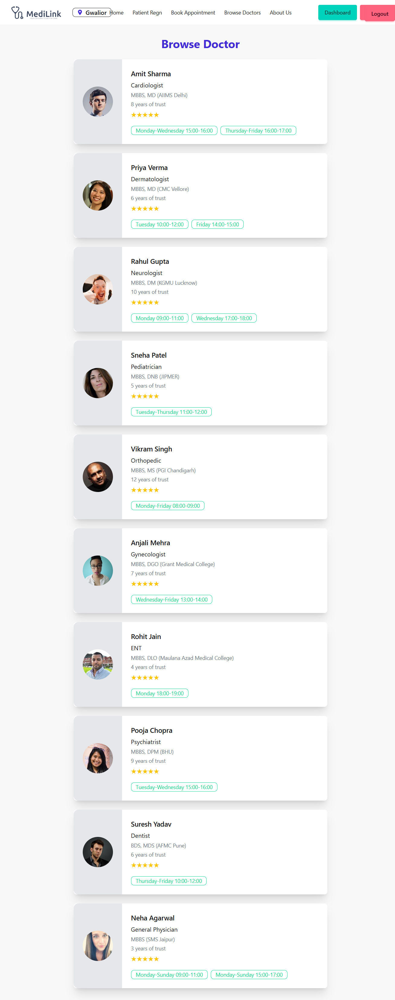
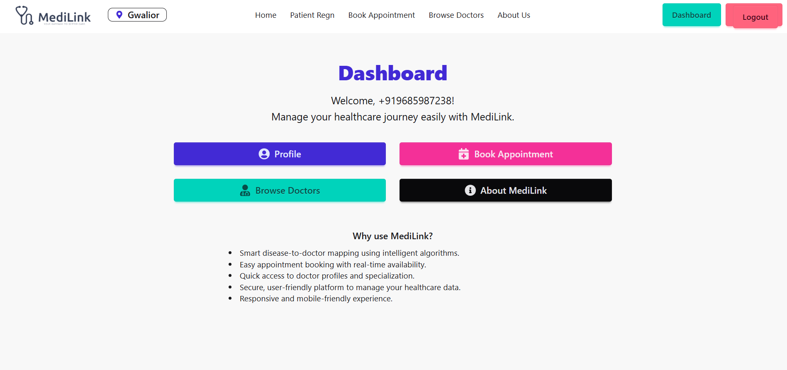
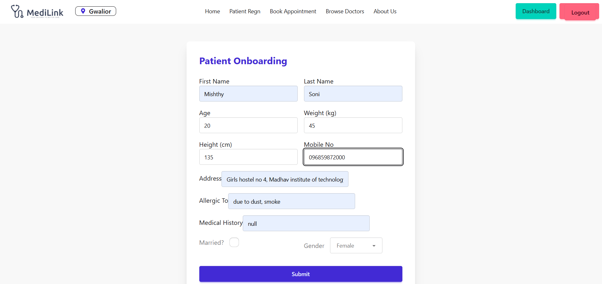
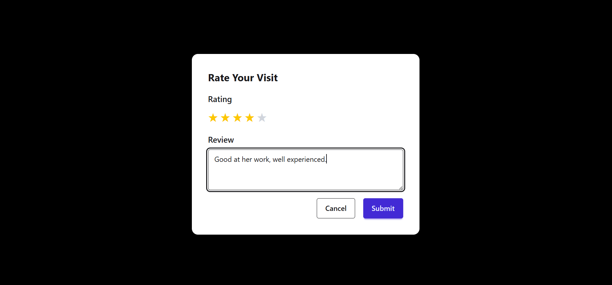
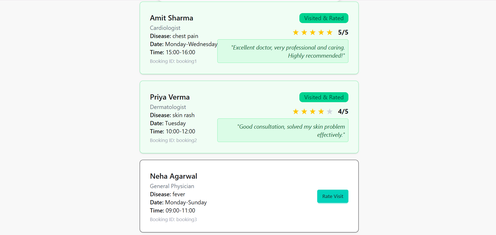

# 🏥 MediLink – Smart Doctor Appointment & Allocation System  

MediLink is a healthcare platform that connects patients with doctors based on their **disease, symptoms, and availability**. It simplifies the process of finding the right doctor and booking appointments seamlessly with real-time slot availability.  

---

## 🚀 Problem Statement  
- Patients often struggle to find the **right doctor** for their symptoms.  
- Existing systems lack **personalized doctor allocation**.  
- Appointment booking is usually **manual, time-consuming, or inefficient**.  
- Patients don’t have enough **reviews or ratings** to make informed choices.  
- There is a need for a **digital healthcare assistant** that offers convenience, personalization, and automation.  

---

## 💡 Our Solution – MediLink  
MediLink solves this by:  
- Automatically **mapping patients to doctors** based on their symptoms/disease.  
- Providing **real-time appointment booking** with doctors’ available slots.  
- Offering **OTP-based mobile authentication** for secure logins.  
- Allowing patients to **rate doctors and give feedback** after appointments.  
- Helping new patients make better choices by **viewing past feedback and ratings**.  

---

## ✨ Key Features  
- 🩺 **Doctor Allocation** – Patients get matched with relevant doctors based on disease/symptoms.  
- 📅 **Smart Appointment Booking** – Book appointments according to doctor’s available slots & patient’s preference.  
- 📱 **OTP Authentication** – Secure login using mobile number.  
- 🔎 **Search & Filter** – Find doctors by specialty, availability, and location.  
- ⭐ **Doctor Ratings & Feedback** – Patients can leave reviews, and new users can check ratings before booking.  
- 🎨 **Modern UI** – Built with Vite + React for a responsive experience.  

---

## 🛠️ Tech Stack  
| Component        | Technology Used |
|------------------|-----------------|
| Frontend         | Vite + React |
| Backend & Auth   | Appwrite |
| Storage          | Appwrite Database |
| Authentication   | OTP (via mobile number) |
| Styling          | Tailwind CSS / DaisyUI (if used) |

---

## 🔄 Workflow  
1. Patient signs up using **mobile OTP authentication**.  
2. Enters **symptoms/disease details**.  
3. System matches the patient with a suitable doctor.  
4. Patient selects preferred date/time from doctor’s available slots.  
5. Appointment is booked and confirmed.  
6. After the appointment, patient can **rate and review the doctor**.  
7. Feedback is stored in the database and shown to new users for informed decisions.  

---

## 📸 Screenshots / Demo (Optional)  

  
  
  
  
  
  
  
  
  
  

